# Home

Wohnprojekt „Am Speicherbogen“: Ein lüneburger wohnprojekt. Gemeinsam planen - gemeinsam bauen - gemeinsam wohnen.

## Aktuelles

Ausgezeichnetes Wohnklima im Speicherbogen...

Unser umweltbewusster und ökologisch nachhaltiger Bau wurde im Sommer 2019 vom Landkreis Lüneburg mit der 'Grünen Hausnummer' ausgezeichnet...

...und im Herbst 2019 wurde unser Projekt mit einem Niedersächsischen Landespreis als 'Zukunftshaus' gekürt! (Es ist schön, das einmal offiziell zu hören: "Das Projekt ist vorbildlich für das Erreichen höchster Energieeffizienz mit nachhaltigen Baumaterialien. Die Idee der Baugemeinschaft für ein innerstädtisches Zusammenleben aller Generationen und Lebenskonzepte ist zukunftsweisend.")

Und kaum zu fassen: nun wurden wir auch auf Bundesebene prämiert: Das BMEL hat uns den HolzbauPlus 2020 Sonderpreis für Strohgedämmte Gebäude zugesprochen! ("In ökologisch nachhaltiger, zukunftsweisender Bauweise sind Gestaltung und Funktionalität zu Architektur vereint, um so den Bedürfnissen von Privatheit, Gemeinschaft und Öffentlichkeit zu entsprechen.")

Wir freuen uns, dass die vielen Ideen der Architekten und unserer Baugruppe nach der mühsamen Planungs- und Bauphase endlich diese tolle Gestalt angenommen haben, und wir merken: 'Bauen bedeutet gestalten von Lebensvorgängen.' (W. Gropius) 

---

## umweltfreundlich • wohngesund • generationsübergreifend

Unser Wohnprojekt im Lüneburger Speicherquartier:

- 19 Eigentumswohnungen
- kinderfreundlich
- innenstadtnah
- 5 Minuten zum Bahnhof
- innovativ und nachhaltig
- gebaut aus Holz, Stroh und Lehm
- mitten in der Stadt
- schnell im Grünen

## Rückblick

 BAUBEGINN war im November 2017. Der lange Winter hat die Erdarbeiten etwas hinausgezögert, aber im Frühjahr 2018 konnte endlich der Holzständerbau errichtet werden.

Im Juni 2018 hat unsere fröhliche GRUNDHOLZLEGUNG stattgefunden: Wir haben den Beginn des Holzständerbaus mit einer ersten Baustellenbegehung incl. Sekt und dem Einbau einer "Zeitkapsel" in eine unserer Holzbauwände gefeiert. Die "Zeitkapsel" wurde mit guten Wünschen für unser Projekt, Gedichten, der aktuellen Tageszeitung sowie Erinnerungsstücken und einem USB-Stick mit diesem Webseiten-Inhalt bestückt und wird uns ab sofort und den Archäologen in der fernen Zukunft viel Freude bereiten.

In den heißen Sommermonaten ging es dann mit dem Einbringen der Strohdämmung weiter, die Dächer wurden abgedichtet, und der Lehmputz wurde aufgebracht (siehe auch unser [Bautagebuch](#bautagebuch)).

Im August 2018 haben wir RICHTFEST gefeiert! Der Richtspruch der Zimmerleute und einige Reden wurden musikalisch umrahmt von Live-Musik, und dann ging es ans bunt bestückte Buffett - von veganen Falafeln bis Leberkäs. Wir konnten hierfür schon unseren künftigen Gemeinschaftsraum nutzen und einen Vorgeschmack bekommen auf künftige Feiern und Veranstaltungen, die hier stattfinden werden... (für weitere Eindrücke vom Richtfest schaut doch mal in den Blog [ichbineinlueneburger](https://ichbineinlueneburger.blog/2018/08/16/wohnprojekt-am-speicherbogen-ein-urbanes-dorf-in-lueneburg/)).

Gut geschützt unter Planen fand dann der Innenausbau und die Fassadengestaltung statt, so dass wir im Sommer 2019 einziehen und die Gebäude mit Leben füllen konnten. Und auch das Außengelände haben wir mittlerweile in mehreren Gemeinsachaftsaktionen gestaltet und bepflanzt. Auch wenn man im Grunde nie fertig wird - man könnte fast meinen, wir wohnten schon immer hier...

Unsere Gruppe besteht mittlerweile aus 32 Erwachsenen und 15 Kindern. Mit einem Durchschnittsalter von 38 Jahren und einer Altersspanne von 0 bis über 80 sind wirklich alle Generationen bei uns vertreten. 

---

# Das Konzept

## Gemeinsam planen

Das Projekt basiert auf dem Gedanken gemeinschaftlichen Wohnens und Planens. Ziel war es, hochwertige ökologische Architektur mit gemeinschaftlichem Leben zu verbinden.

## Kosten

Kostendisziplin, das Vermeiden von Kaufnebenkosten und die Tatsache, dass keine Unternehmensgewinne erwirtschaftet werden müssen, führen zu einem ausgesprochen guten Preis‑Leistungs‑Verhältnis. Gleichzeitig wurde Wert auf hohe bauliche und ökologische Qualität gelegt.

Die Unterhalts- und Verbrauchskosten wurden bei der Planung bewusst berücksichtigt. Entscheidend ist nicht nur die Finanzierung, sondern auch die langfristige Tragbarkeit der Nebenkosten.

Der Quadratmeterpreis „Am Speicherbogen“ lag – je nach Lage der Wohnung – zwischen 2.750 € und 2.900 €. Die Wohnungen wurden schlüsselfertig übergeben. Ein etwa 70 qm großer Gemeinschaftsraum war bereits im Preis enthalten.

## Gemeinsam bauen

Im Winter 2017 wurde mit dem Bau begonnen.

## Gemeinsam wohnen

Seit Sommer 2019 ist der Speicherbogen bewohnt.

---

# Die Gruppe

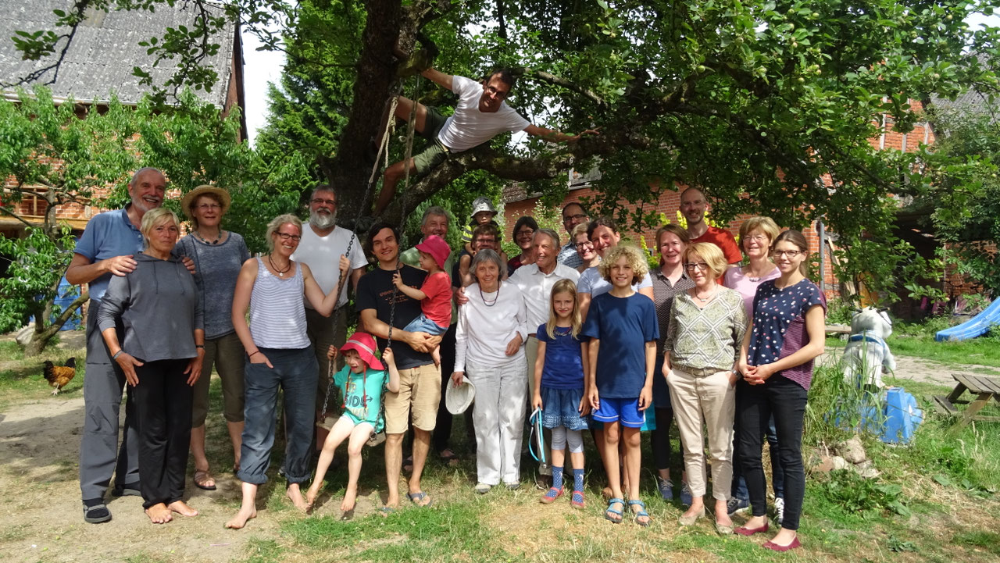
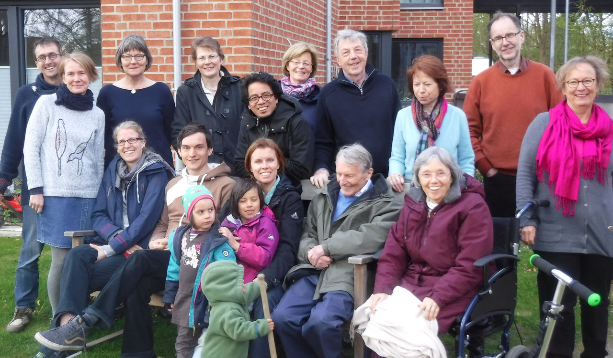

## ich bin im wohnprojekt...

- ...weil es schön ist, dass, wenn ich abends spät nach Hause komme und noch Licht in einer der Wohnungen im „Häuserblock“ sehe, ich weiß, dass dort ein Mensch lebt, den ich kenne. (Ute)
- Wo man offen ist füreinander, ergeben sich aus unterschiedlichen Interessen und Erfahrungen ganz neue Möglichkeiten. (Anke)
- Ich mache mit, weil ich mehr will als eine schöne Wohnung und nette Nachbarn. (Ulrich)
- ...weil es gemeinsam leichter ist, ökologisches Bauen zu verwirklichen. (Andrea)
- ...weil ich mir Leben mit gleichgesinnten Menschen, eine lebendige Nachbarschaft und Gedankenaustausch wünsche. (Elisabeth)
- ...weil Vieles gemeinsam mehr Freude macht und Ressourcen spart. (Betty)
- ...weil es so viele Vorteile gibt, nicht im Kleinen vor sich hin zu wurschteln, sondern zu teilen, sich auszutauschen und sich zu unterstützen. (Nadine)
- Die Lage unseres Projektes in ruhiger Zentrums- und Bahnhofsnähe in Lüneburg freut uns sehr. (Jürgen, Angela mit Lotte)
- Ich freue mich, seit einem Jahr in einer Gemeinschaft von Menschen zu sein, die sich entschieden haben, bewusster und achtsamer zu leben. (Dorothea)
- ...weil ich realistische Zukunftsperspektiven entdecken und ausprobieren möchte. (Samuel)
- Die Entscheidung für eine (Bau)-Gemeinschaft haben wir bewusst getroffen, um auch nach der Bauphase in engem Kontakt mit den Nachbarn zu bleiben. (Caro und Thomas)

## warum Lüneburg:

- Lüneburg ist klein genug für kurze Wege und groß genug für kulturelle Vielfalt. (Ute)
- Lüneburg verbindet Altstadt, Wasser, Natur und gute Anbindung nach Hamburg. (Anke & Ulrich)
- In Lüneburg ist Platz für viele Ideen. (Andrea)
- Lüneburg bietet kulturelle Vielfalt, offene Begegnungsstätten und junge Menschen. (Elisabeth)
- Die Stadt hat Charme, Atmosphäre, Kunst, Kultur und kurze Wege. (Betty)
- Die Studentenszene prägt Offenheit und Austausch. (Dorothea)
- Lüneburg ist grün, familienfreundlich und voller spannender Initiativen. (Nadine)
- Die Geschwindigkeit des Alltags passt zur Größe der Stadt. (Samuel)
- Lüneburg verbindet Natur, Historisches, Kultur und hohe Lebensqualität. (Thomas)

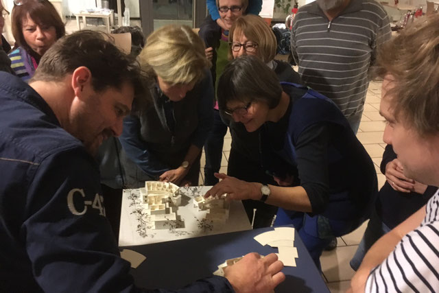
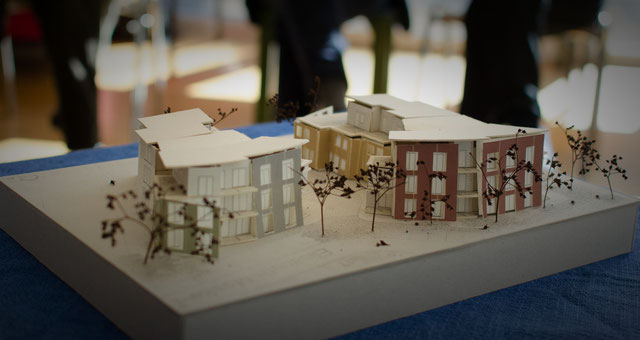
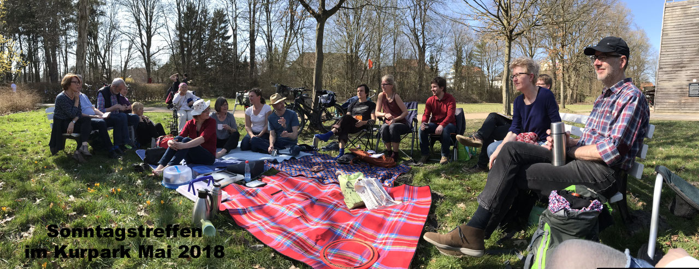

---

# arch.tekton

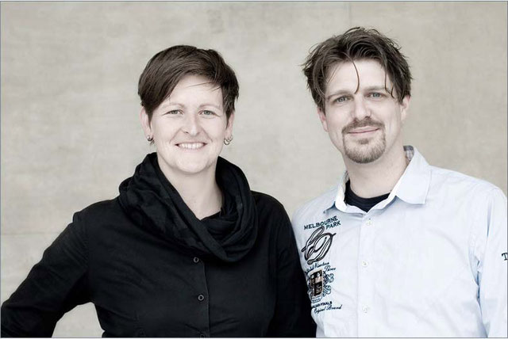

"Baust Du ein Haus, denke an die Stadt UND den Mensch!“
(frei nach Luigi Snozzi)

Diesen beiden Leitideen folgend versuchen wir jedes Projekt in seiner Gesamtheit zu erfassen und die Wünsche und Vorstellungen der Bauherren zum Einen, aber eben auch die Bedürfnisse der Stadt und somit der in Ihr lebenden Menschen zu achten. Konzipieren, Entwerfen, Bauen verstehen wir als Teamarbeit, bei der sich die besten Ideen durchsetzen und wir als Architekten mehr begleiten als vorgeben. Deshalb arbeitet arch.tekon als eine offene Plattform - unterstützt durch ein interdisziplinares Netzwerk - die sich für jedes individuelle Projekt neu zusammenstellt. Wir entwickeln mit Ihnen bessere Lösungen für das Arbeiten und Lernen, Wohnen und Leben für eine gemeinsam Zukunft in einem gleichberechtigten StadtRaum. 

# delta grün

## Dirk Scharmer

Dirk Scharmer plant seit 1998 besonders ökologische Gebäude für Nachbarschaft und Gemeinschaft. Seit 2003 forscht und entwickelt er am Bauen mit Holz, Lehm und Stroh und hat als Pionier diese Bauweise in Deutschland und Europa baurechtlich vorangebracht und salonfähig gemacht.

2005 plante er das erste dreigeschossige strohgedämmte Mehrfamilienhaus in Deutschland, 2012 gemeinsam mit dem Kollegen T. Isselhard das europaweit bislang größte 5-geschossige Bürogebäude in dieser Bauweise in Verden/ Aller. Daneben sind mittlerweile unter seiner Federführung zahlreiche weitere Wohnhäuser in strohgedämmter, lehmverputzter Holzbauweise entstanden, etliche davon im Ökodorf Sieben Linden, einem sozial-ökologischen Modellprojekt in der Altmark.

Dirk Scharmer ist anerkannter Passivhausplaner, Baubiologe und Koordinator für nachhaltiges Bauen (BNB). Sein Planungsbüro in Lüneburg bietet mit aktuell 4 Fachkräften aus den Bereichen Architektur und Holzbau neben den klassischen Architektenleistungen auch Leistungen für besonders energieeffiziente Gebäude, z.B. KfW-Effizienzhäuser an.

Mit dem Konzept DELTAGRÜN ARCHITEKTUR konzentriert sich das Team auf Lösungen, die sowohl im Betrieb als auch in der Herstellung umweltfreundlich sind. DELTAGRÜN möchte in Deutschland Impulse für nachhaltiges Bauen mit nachwachsenden Rohstoffen setzen und nutzt die Ökobilanzierung um den Unterschied von zukunftsfähigen Bauweisen zum konventionellen Bauen sichtbar zu machen.

Nach Jahren der sorgfältigen Vorbereitungs- und Nachweisarbeit sieht das Team aktuell einem stark gestiegenen Interesse an besonders ökologischen nachbarschaftlichen Bauweisen entgegen.

(Anmerkung zu Erläuterung: das griechische Delta steht als Symbol Δ für die Differenz, hier gemeint als ökologischer „grüner“ Unterschied)

## Strohbauweise

Mit Holz, Lehm und Stroh lassen sich moderne, behagliche und langlebige Gebäude errichten, die sowohl im Betrieb als auch in der Herstellung besonders umweltfreundlich sind. Die Verwendung von Stroh als Dämmstoff ist in Deutschland erst seit wenigen Jahren bauaufsichtlich zugelassen, kann aber weltweit auf eine mehr als hundertjährige erfolgreiche Anwendung und Tradition zurückblicken.

Stroh kann direkt vom Acker nebenan in landwirtschaftsüblicher Form als anerkannter Dämmstoff eingesetzt werden, sowohl für Herstellung als auch für den Transport entstehen nur minimale schädliche Umwelteinflüssen. Es wird mit ausgerichteten Halmen in Ballenform in ein Holzständerwerk eingesetzt und direkt verputzt. Auf der Innenseite kann hierbei der wohngesunde Baustoff Lehm eingesetzt werden, auf der Außenseite z.B. Kalkputz. Strohgedämmte Wände sparen durch höchste Wärmedämmwerte Heizenergie im Betrieb des Gebäudes, gleichzeitig wird für ihre Herstellung ebenfalls unschlagbar wenig Energie aufgewendet.

Das Bauen mit Holz, Stroh, und Lehm spart Ressourcen und minimiert die Nutzung seltener und unökologischer Materialien. Holz und Stroh stehen als nachwachsende Rohstoffe in Deutschland reichlich zur Verfügung, auch Lehm ist hierzulande beinahe unbegrenzt vorhanden. Die Verwendung nachwachsender Rohstoffe für langlebige Bauprodukte bietet gegenüber natürlichen Baustoffen mineralischer Herkunft noch einen weiteren Vorteil: Für die Dauer ihres Einsatzes in Bauteilen entziehen sie der Atmosphäre das während das Pflanzenwachstums über Photosynthese gespeicherte Kohlendioxid und entlasten so das Klima. Wer heute mit nachwachsenden Rohstoffen wie Stroh und Holz baut, leistet einen wichtigen Beitrag zum Klimaschutz gerade für die besonders wichtigen, kommenden Jahrzehnte.

Die Verwendung von Holz, Stroh und Lehm ermöglicht ein besonders gesundes, ausgeglichenes Raumklima.

Noch ist Holzbau und noch mehr die Verwendung von Stroh als Dämmstoff ein Randthema, gerade in Norddeutschland tun sich manche, klinkergewöhnte Menschen damit schwer. Tausende von strohgedämmten Gebäuden in ganz Europa und auch weltweit stellen mittlerweile aber eindrucksvoll unter Beweis: die Strohbauweise kann es mit den herkömmlichen Bauweisen aufnehmen und wird immer mehr zu einer ernstzunehmenden, langlebigen und bezahlbaren Alternative. Ausgeführt von regionalen Handwerkern mit regionalen Rohstoffen stärkt sie ganz nebenbei auch noch die lokale Wirtschaft. 

---

# Bautagebuch

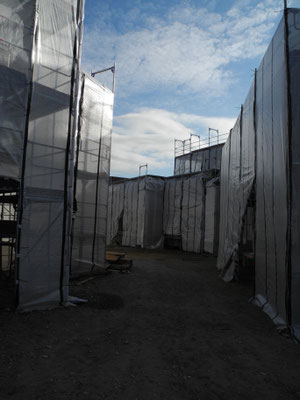
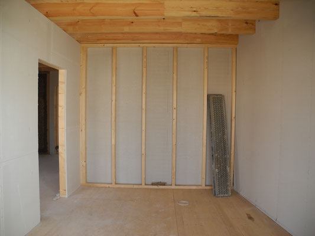
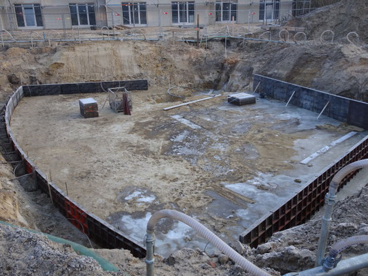
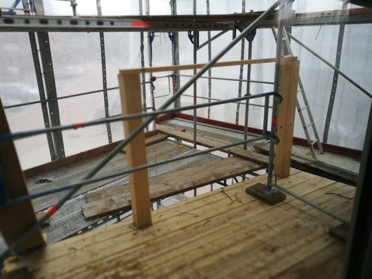
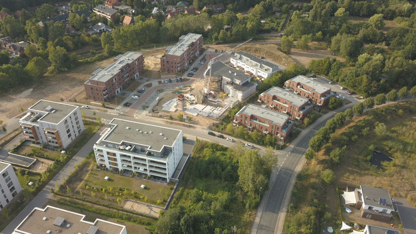
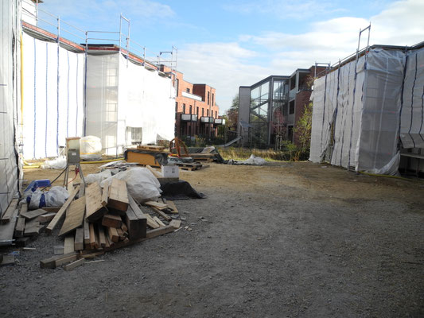
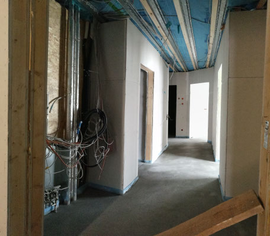

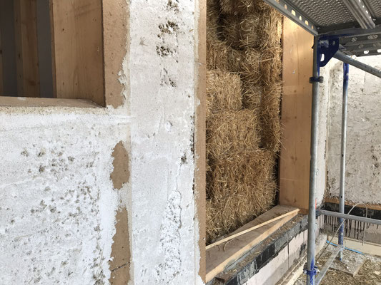
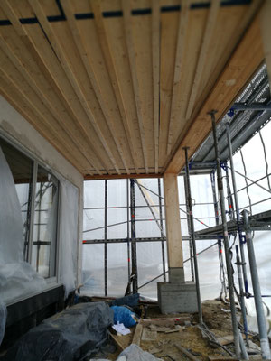
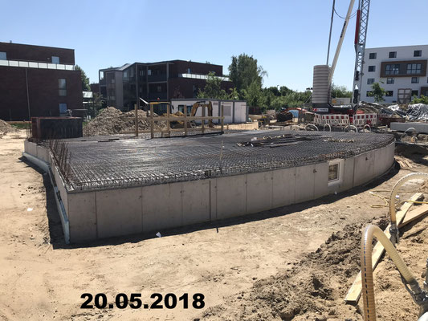
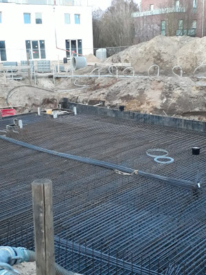
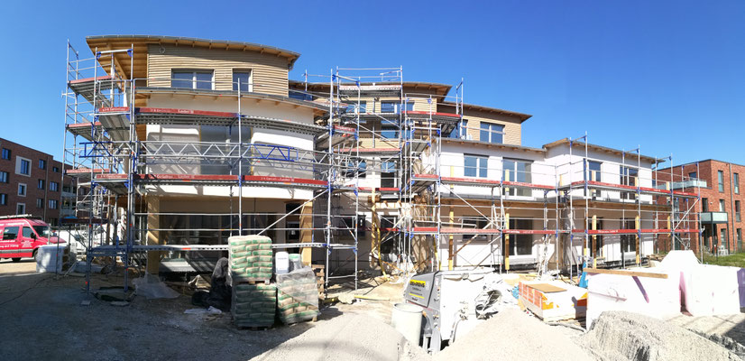
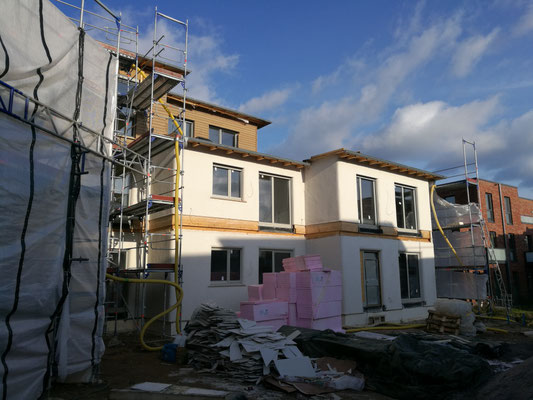
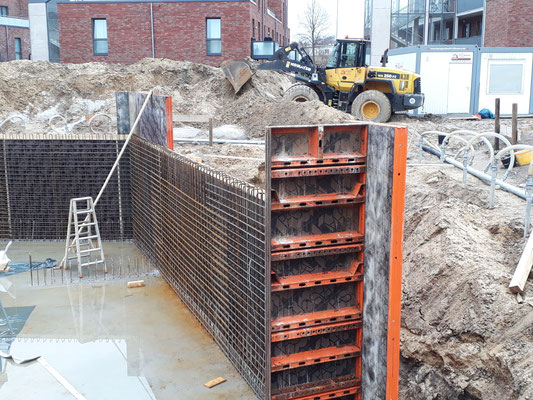
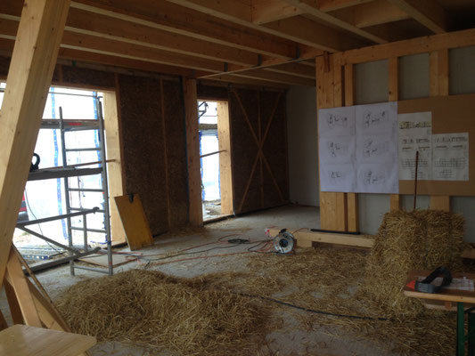
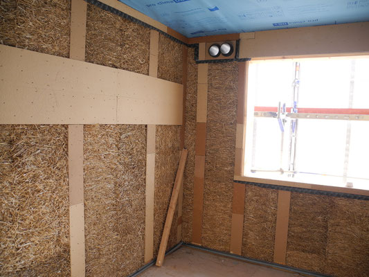
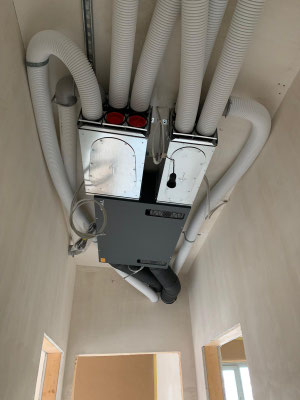
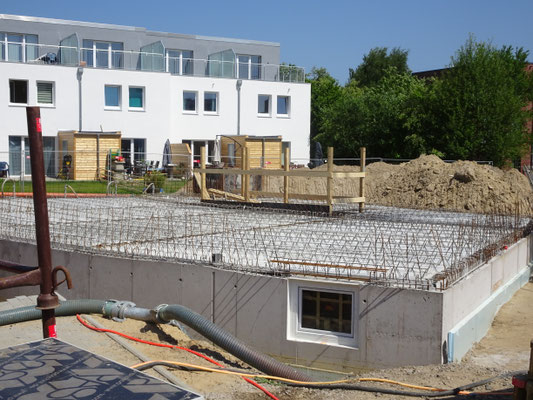
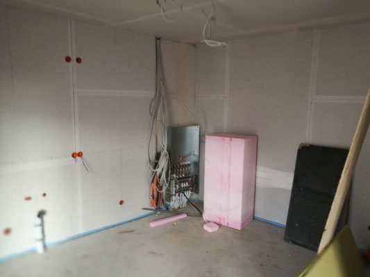
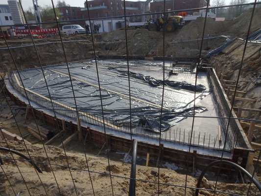
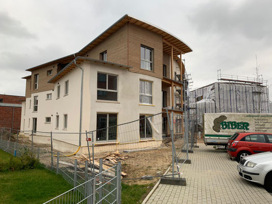
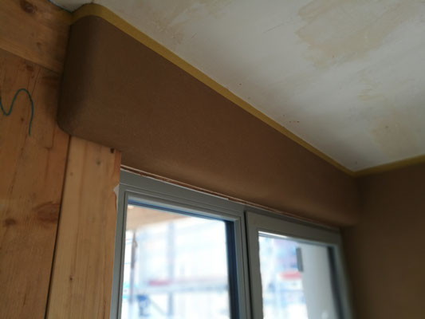
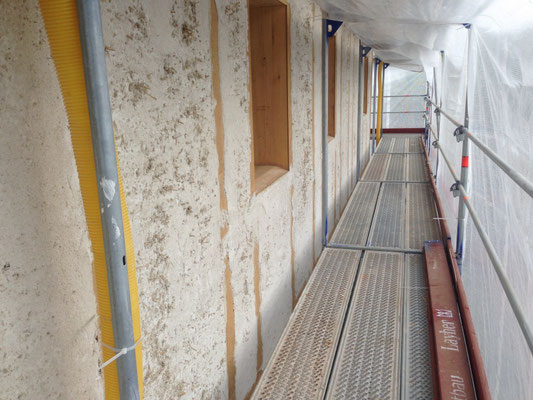
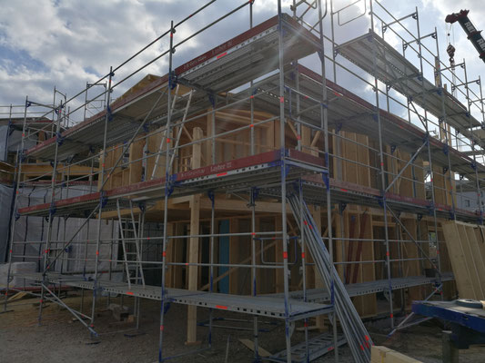
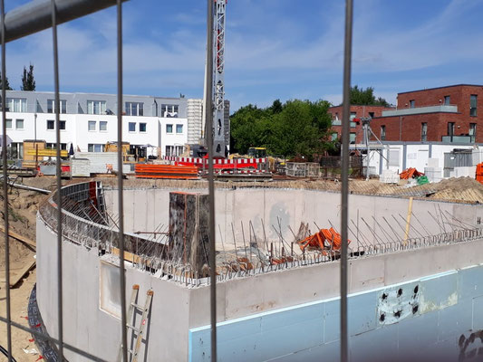
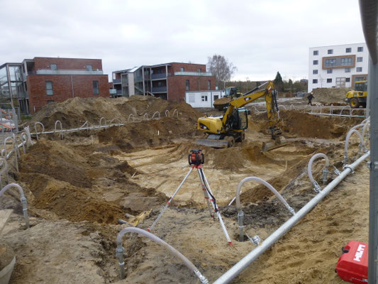
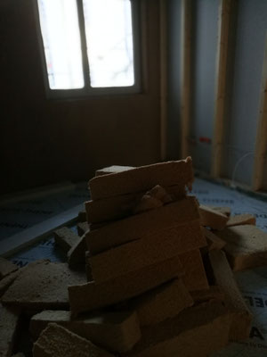
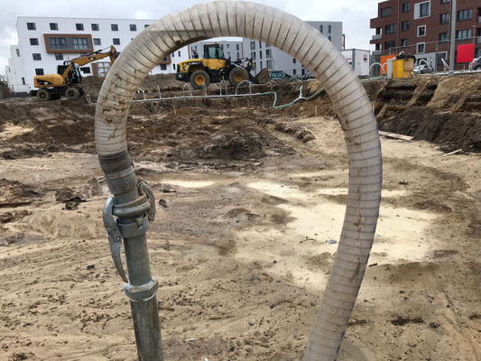
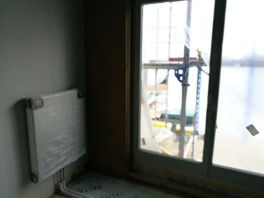
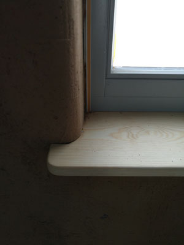
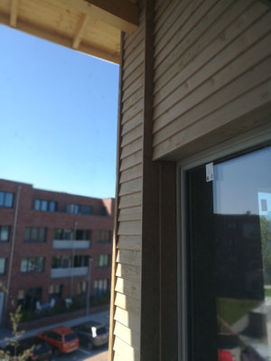
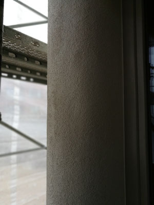
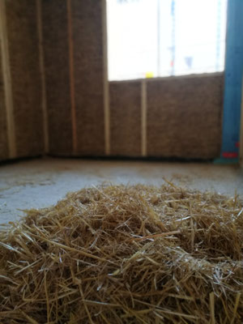
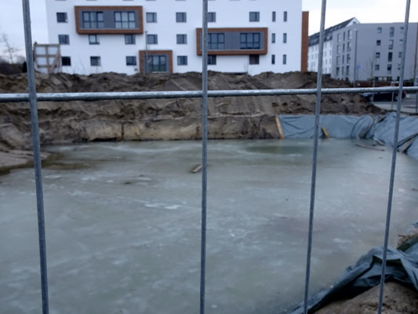
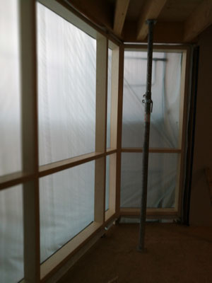
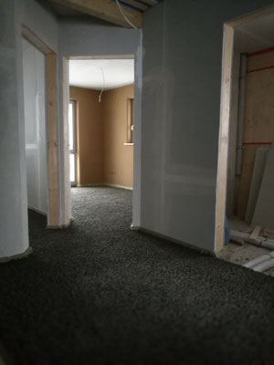
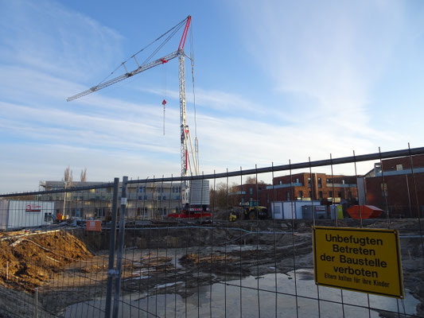
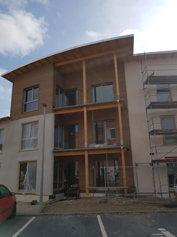
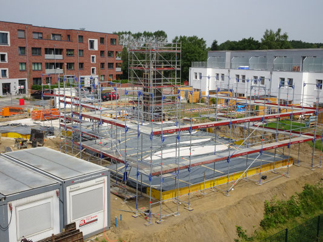
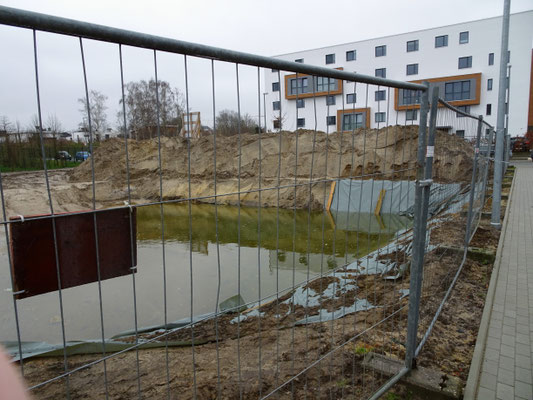
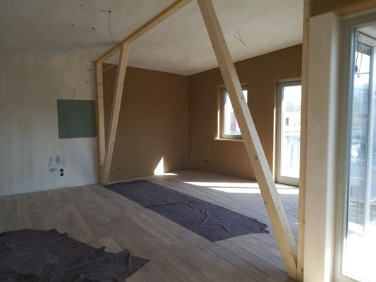
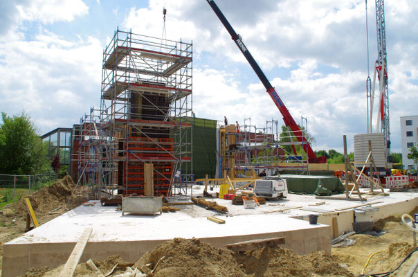
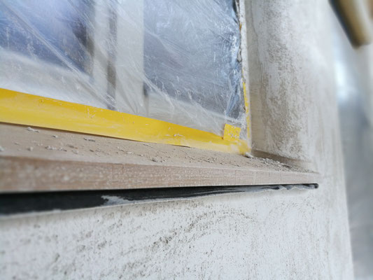
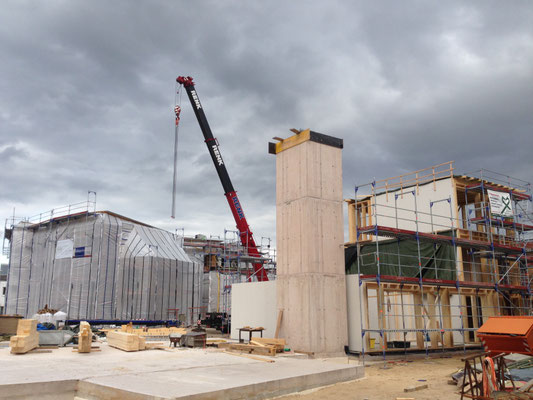


---

# Kontakt

Bei uns gibt es momentan keine freien Wohnungen. ;)

`**`speicherbogen-lueneburg ätt posteo.de`

Wer Interesse an unserem Wohnprojekt oder Gebäude hat, ist herzlich eingeladen. Aber: Kontaktiert uns bitte vorher und verabredet euch mit uns. Lauft nicht einfach aufs Gelände. 

---

## Impressum

### Betreiberin der Website

Hinweise gem. § 6 des Teledienstegesetzes (TDG) in der Fassung des Gesetzes über rechtliche Rahmenbedingungen für den elektronischen Geschäftsverkehr (EGG) in der Fassung vom 20.12.2001.

Herausgeberin / Betreiberin der Website:
Am Speicherbogen GbR
Elisabeth-Maske-Str. 2
21337 Lüneburg
E-Mail: speicherbogen-lueneburg ätt posteo.de  

###  Datenschutzhinweis:

Personenbezogene Daten werden von uns lediglich zur zweckbezogenen Durchführung Ihrer Anfrage verwendet. Eine weitergehende Nutzung z. B. für Werbezwecke ohne Ihr ausdrückliches Einverständnis hierzu ist ausgeschlossen. planW setzt keine Cookies auf der Homepage ein.

Wir bemühen uns, auf dieser Website richtige und vollständige Informationen zur Verfügung zu stellen. Wir übernehmen jedoch keine Haftung oder Garantie für die Aktualität, Richtigkeit und Vollständigkeit der auf dieser Website bereitgestellten Informationen. Dies gilt auch für alle Links (Verbindungen), auf die diese Website direkt oder indirekt verweist. Wir sind für den Inhalt einer Seite, die mit einem solchen Link erreicht wird, nicht verantwortlich.

Aus Gründen des Urheberrechts ist die Speicherung und Vervielfältigung von Bildmaterial aus dieser Website nicht gestattet.
Wir haften nicht für direkte oder indirekte Schäden, die aufgrund von Informationen oder Dateien entstehen, die auf dieser Website bereitgehalten werden.

Wenn Sie innerhalb dieses Angebots Seiten und Dateien abrufen und dabei aufgefordert werden, Daten über sich einzugeben, so weisen wir darauf hin, dass diese Datenübertragung über das Internet ungesichert erfolgt und die Daten somit von Unbefugten zur Kenntnis genommen oder auch verfälscht werden können.

**Inhalte:**
Wir sind bestrebt, sicherzustellen, dass die Inhalte der Website korrekt und auf neuestem Stand sind. Dennoch sollten Sie sich individuell und persönlich beraten lassen und so die aktuellen Daten und Kosten erfragen.

**E-Mail:**

Wir unternehmen alle vernünftigerweise zu erwartenden Vorsichtsmaßnahmen, um das Risiko einer Übertragung von Computerviren zu verhindern. Wir sind jedoch nicht haftbar für Schäden, die durch Computerviren entstehen. Bitte führen Sie selber Überprüfungen auf Computerviren durch, bevor Sie E-Mails lesen, insbesondere bevor Sie Anhänge zu E-Mails öffnen.

Die Kommunikation per E-Mail ist unsicher, da grundsätzlich die Möglichkeit der Kenntnisnahme und Manipulation durch Dritte besteht. Wir empfehlen, daher keine vertraulichen Daten unverschlüsselt per E-Mail zu versenden. 